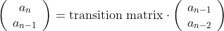

# 解題心得
[NCU OJ連結](http://140.115.50.98/)

這裡面有目前為止在NCUOJ上我寫過的題目的題解以及心得，雖然我的解法有些不是那麼好，但希望能幫助到想了解這些題目背後的演算法的人。

## 目錄
- NCU競程題解
    - [資料結構](#資料結構)
        - [判斷有沒有環](#判斷有沒有環)
    - [數學](#數學)
        - [x的k次方(快速冪)](#x的k次方)
    - [枚舉](#動態規劃)
    - [貪心法](#動態規劃)
    - [動態規劃](#動態規劃)
        - [又是硬幣問題](#又是硬幣問題)
        - [01背包問題](#01背包問題)
        - [費氏數列+快速冪](#費氏數列+快速冪)
## 資料結構
### 判斷有沒有環
[Code](https://github.com/flyotlin/practice-cpp/blob/master/datastructure/%E5%88%A4%E6%96%B7%E6%9C%89%E6%B2%92%E6%9C%89%E7%92%B0.cpp)

[圖論參考](https://hackmd.io/@royyaha/B1J17UcsI?fbclid=IwAR1TrVqVe_k-eTOUYRvCNzKgodMUMaJQFelZCE5z2KlHlxGv4DX6LS5shuA)

#### 圖(Graph)
一般在現實生活中看到的圖大概長這樣

但是我們要怎麼把這樣的圖儲存在電腦中呢? 常見的方法有兩種，**Adjacency Matrix**以及**Adjacency List**。
* Adjacency Matrix:儲存點與點之間的相連關係，如果有連接則為1，沒連接則為0，而實作時常用二維陣列，這也是被命名為matrix的原因。
* Adjacency List:儲存每個點的所有相鄰的點，所以才會被稱為一個list。

大致上了解如何儲存圖之後，我們還需要了解圖的分類。有向圖、無向圖，以及權重，這部分可以參考上面的[圖論參考](https://hackmd.io/@royyaha/B1J17UcsI?fbclid=IwAR1TrVqVe_k-eTOUYRvCNzKgodMUMaJQFelZCE5z2KlHlxGv4DX6LS5shuA)。

接著，我們還想知道怎麼遍歷一個圖，畢竟我們或許想存取裡面的資料也說不定，誰知道什麼時候會用到呢。常見遍歷圖的方法有兩種:
* DFS(深度優先搜尋) -見下說明
* BFS(廣度優先搜尋) -留到下一題再來說明

除此之外，我們還發現圖好像跟另一種資料結構-樹(Tree)有點像，這兩個有什麼差別?簡單來說，差別就在樹沒有環，而圖有環。

那麼什麼是環呢?環就是可以在圖上繞成一個圈，廣義來說也可以**自環**，也就是自己這個點繞到自己這個點。要注意的是子節點與父節點之間是不能繞成一個圈的，這在本題判斷有沒有環當中扮演了重要的角色。
#### DFS遍歷
這邊我用Adjacency List來寫DFS。除了圖本身之外，我們還需要一個visit的陣列來判斷那個點是否已經被造訪過了。

DFS，深度優先搜索，顧名思義就是每造訪一個新的節點時就往他最深的可能處造訪，直到最深後再返回，往下一個**同深度**的節點的最深可能處造訪，而這也跟stack的概念有些相似。在這邊我用c++ stl內建的vector來取代stack，vector其實也跟stack有類似的概念，LIFO。

stack概念在dfs裡是，如果造訪一個點，就把他push到stack裡面去，接著持續這個動作。若該點已經沒有相鄰、沒造訪過的點，就把他pop掉。可以看看這部影片，把dfs與stack的關係視覺化的滿好的，只是英文口音有點母湯: [Depth First Search Algorithm](https://www.youtube.com/watch?v=iaBEKo5sM7w)。

每次造訪一個點後就把visit[那個點]設為true。在選擇下一個遍歷的點時，如果該點已被造訪過就不再次造訪該點。
#### 本題
我寫這題的時候所用的建圖方式是Adjacency List，想知道Adjacency Matrix怎麼寫的話可以參考演算法筆記的Graph篇。

題目說測資所給的圖是無向圖，所以在建圖的時候要把雙向關係都考慮進去。其實這題寫出圖的dfs遍歷之後再稍微改一下判斷條件就能解出來了。

在dfs的過程中，如果**碰到已經拜訪過的點** (visit[G[u][i]] == true)，而且**那個點不是父節點的話** (G[u][i] != prev)，就代表這個圖有環。因為父節點與子節點之間的連結並不能繞成一個圈，因此也就不是一個環。

Code中的ARing這個變數是用來判斷是否為一個環，如果是再輸出YES，否則輸出NO。

### x的k次方
[Code](https://github.com/flyotlin/practice-cpp/blob/master/math/x%E7%9A%84k%E6%AC%A1%E6%96%B9.cpp)

[參考(維基百科)](https://zh.wikipedia.org/wiki/%E5%B9%B3%E6%96%B9%E6%B1%82%E5%B9%82)

這個題目運用到了快速冪。快速冪的公式大概長這樣(從維基百科找來的)

其實快速冪的概念我們很久以前就已經會了，只是在寫程式的時候沒有特別想到這樣實作，而是採用for迴圈的方式。

舉例來說，如果要計算，在寫程式的時候你或許會直接用for迴圈重複執行100次，這樣時間複雜度是。

但如果先算出，再將結果平方。只要反覆運用這種先將指數次方除以2，再將結果平方的方式，就能將時間複雜度降低為，而這也就體現出了上面快速冪公式的精神。

快速冪除了運用在多項式的指數次方問題之外，也可以運用在矩陣的指數次方上。最著名的例子就可以運用在費氏數列上，詳情可以參考我下面寫的[費氏數列+快速冪](#費氏數列+快速冪)，這樣同樣可以讓計算費氏數列第項的時間優化為。

## 動態規劃
一般在思考動態規劃的問題，都會先觀察題目，接著再定義出適合的狀態以及轉移式。
### 又是硬幣問題
[Code](https://github.com/flyotlin/practice-cpp/blob/master/algorithm/dynamic%20programming/coin-dp.cpp)

這題一開始給定了數種硬幣的面額，接著給定一個金額，希望你可以求出能夠組成該金額的最少硬幣總數。

比較天真的想法是先將硬幣面額由大排到小，接著從大到小拿硬幣來組合出該金額。如此一來看起來可以解決這個問題。這種方法運用了貪心法的概念，每次都選擇最佳解或者最大解，但
#### 狀態:

#### 轉移式:

### Note:

希望之後會補上~
### 01背包問題
[Code](https://github.com/flyotlin/practice-cpp/blob/master/algorithm/dynamic%20programming/01knapsack_problem.cpp)

名稱中的01聽說是代表物品放或不放的意思。題目給定背包的大小，以及若干物品。為了讓狀態更好定義，我們可以把給定的背包大小假設為m。編號若干物品為Wi，從0開始算起。其中n為物品的總數量-1(因為從0開始編號)。
#### 狀態: 
> 

空間為m時，從物品W0-Wn，選擇放或者不放的**最大價值**。一般dp的n=0都定義為沒有物品。如果n=0定義成W0~W0，則需要另外判斷沒有物品的狀況。
dp可以想像成一個二維陣列，列(row)為m，行(column)為n。
#### 轉移式:
> **dp(m, n) = max{dp(m, n-1), dp(m-第n個物品所占空間, n-1)+第n個物品的價值}**

* 

不放Wn的狀況，因此最大價值則跟dp(m, n-1)相同。

* **dp(m-第n個物品所占空間, n-1)+第n個物品的價值**

放Wn的狀況，因此我們需要騰出Wn所站的空間(m-Wn的空間)。

#### 初始值:
動態規劃的題目在定義好狀態以及轉移式之後，還需要給定初始值。如此一來才能由初始值，依照上面定義好的狀態以及轉移式來求解。

01背包問題的初始值，也就是我們可以事先定義好的值，包括了二維陣列dp中的第一列以及第一行。dp第一列代表空間為0，所以最大價值都是0。dp第一行代表沒有物品可以選擇，所以整行的最大價值也都是0。

#### Note:
這題算是動態規劃中比較進階一點的題目，我一開始在寫的時候也覺得滿不直覺的。特別是這題狀態的定義dp(m, n)，第一次寫的時候也覺得這個定義很tricky。

邊界的判斷也是這題常常會出錯的地方。在寫之前我都習慣用紙筆先草擬一遍，把整個程式的大致流程在紙上走過一遍，這樣在寫code的時候，比較有穩固的背後基礎。

### 費氏數列+快速冪
[Code](https://github.com/flyotlin/practice-cpp/blob/master/algorithm/dynamic%20programming/%E8%B2%BB%E6%B0%8F%E6%95%B8%E5%88%97%2B%E5%BF%AB%E9%80%9F%E5%86%AA.cpp)

我們都知道費氏數列的遞迴式是。比較一般的做法，也就是用for迴圈來計算的話，時間複雜度大約是。但其實我們可以先計算出費氏數列的**轉移矩陣**，接著再利用**快速冪**的方式來計算的數值，這個方法可以將時間複雜度優化到。

#### 什麼是快速冪?
假設現在要你計算你會怎麼算?是將5連乘100次?還是先算出，再把平方來得到?

數學課計算時我們的確時常會運用這樣的技巧，而這種技巧就是快速冪的概念。只可惜我們在寫程式的時候卻常常直接用for迴圈來暴力解決這類型的指數問題，時間複雜度因而變為，但只要運用快速冪這類的概念，就能將時間複雜度降低為了。

將快速冪寫成比較數學的形式大概是以下這樣:

>

#### 費氏數列的轉移矩陣
我們已經知道，關係式為。

可以先假設轉移矩陣為，帶入兩組已知的數值，再經過高中數學教過的計算得到**轉移矩陣**:。

從開始計算的話，就會變成

，其中指數n就是這次快速冪的主角，透過快速冪將指數計算的時間複雜度降為而提升費氏數列的計算速度。
